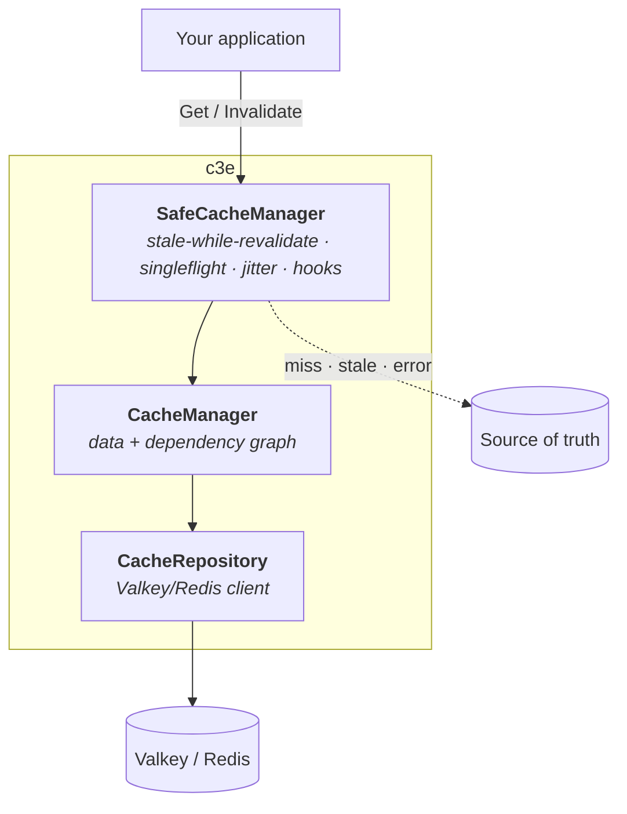
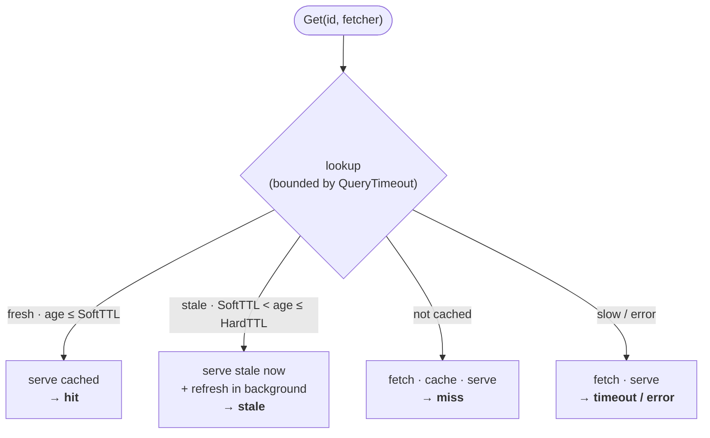

# 🚀 c3e — Cache with Cascading Expiration Engine

[](https://pkg.go.dev/github.com/slashdevops/c3e)
[](https://golang.org/)
[](https://valkey.io/)
[](https://github.com/slashdevops/c3e/actions/workflows/codeql.yml)
[](LICENSE)

**c3e** is a high-performance, dependency-aware caching layer for Go built on top
of [Valkey](https://valkey.io/) (Redis-compatible). It adds dependency tracking
with cascading invalidation, stale-while-revalidate, thundering-herd protection,
TTL jitter, and type-safe operations on top of a plain cache.

## ✨ Features

- **🔗 Dependency tracking & cascading invalidation** — invalidate one entity and
  every entry that depends on it is dropped, transitively.
- **⚡ Stale-while-revalidate** — serve cached data instantly while refreshing in
  the background.
- **🛡️ Thundering-herd protection** — singleflight ensures one fetch per key
  under concurrent load.
- **🎯 Type-safe operations** — generics give compile-time safety.
- **🎲 TTL jitter** — randomized expiry prevents synchronized stampedes.
- **🔥 Fast fallback** — a short query timeout falls back to your source when the
  cache is slow or down.
- **📈 Observability** — an injectable `slog` logger plus metrics/tracing hooks.

## 📦 Installation

```bash
go get github.com/slashdevops/c3e
```

**Requirements:** Go 1.26+ · [valkey-go](https://github.com/valkey-io/valkey-go)
v1.0.76+.

## 🚀 Quick start

```go
package main

import (
    "context"
    "time"

    "github.com/slashdevops/c3e"
    "github.com/valkey-io/valkey-go"
)

type Project struct {
    ID    string `json:"id"`
    Name  string `json:"name"`
    Owner string `json:"owner"`
}

func main() {
    // 1. Valkey client.
    valkeyClient, err := valkey.NewClient(valkey.ClientOption{
        InitAddress:  []string{"localhost:6379"},
        DisableRetry: true, // fail fast instead of queueing when the cache is down
    })
    if err != nil {
        panic(err)
    }
    defer valkeyClient.Close()

    // 2. Cache stack.
    cacheManager, err := c3e.NewCacheManager(valkeyClient, false)
    if err != nil {
        panic(err)
    }
    cache, err := c3e.NewSafeCacheManager(cacheManager, c3e.SafeCacheManagerConfig{
        HardTTL:       5 * time.Minute, // absolute expiration
        SoftTTL:       3 * time.Minute, // stale-after (≈60% of HardTTL)
        JitterPercent: 0.1,             // 10% TTL jitter
    })
    if err != nil {
        panic(err)
    }

    // 3. Read through the cache. On a miss, the fetcher runs and its result is
    //    cached together with the entities it depends on.
    ctx := context.Background()
    id := c3e.CacheIdentifier{Type: "project", ID: "123"}

    project, err := c3e.GetSafe(ctx, cache, id,
        func(ctx context.Context) (Project, []c3e.CacheIdentifier, error) {
            p := Project{ID: "123", Name: "Eagle", Owner: "user-456"}
            deps := []c3e.CacheIdentifier{{Type: "user", ID: p.Owner}}
            return p, deps, nil
        })
    if err != nil {
        panic(err)
    }
    _ = project

    // When the owner changes, every entry depending on it is invalidated.
    _ = cache.Invalidate(ctx, c3e.CacheIdentifier{Type: "user", ID: "user-456"})
}
```

## 🏗️ How it works

`c3e` layers a low-level Valkey primitive under an application-facing,
stale-while-revalidate API:



Every `Get` resolves to one outcome, reported to the `OnGet` hook as a `Result`:



Fresh and stale both serve immediately; miss/timeout/error fall back to the
source with concurrent callers collapsed into a single fetch. For the full
picture — the key scheme and the dependency reverse index — see
[docs/architecture.md](docs/architecture.md).

## 📚 Documentation

Full documentation lives in [`docs/`](docs/README.md):

- [Architecture](docs/architecture.md) — layers, read path, key scheme, cascade.
- [Usage](docs/usage.md) — worked examples and composition patterns.
- [Configuration](docs/configuration.md) — every config field and how to tune it.
- [Observability](docs/observability.md) — the logger and the hooks.
- [Best practices](docs/best-practices.md) — do/don't and troubleshooting.
- [Limitations & semantics](docs/limitations.md) — the invalidation contract and
  consistency model. **Read this before production use.**

API reference: [pkg.go.dev/github.com/slashdevops/c3e](https://pkg.go.dev/github.com/slashdevops/c3e).

## 🤝 Contributing

Contributions are welcome. Please make sure the suite is green before opening a
pull request:

```bash
go test -race ./...                                   # unit tests
docker run -d --rm -p 6379:6379 valkey/valkey:latest  # for the integration tag
go test -race -tags=integration ./...
```

## 📄 License

Licensed under the Apache License 2.0 — see [LICENSE](LICENSE).

## 🙏 Acknowledgments

- Built for [Valkey](https://valkey.io/), the high-performance Redis alternative.
- Inspired by HTTP `Cache-Control` `stale-while-revalidate`.
- Thundering-herd protection via
  [golang.org/x/sync/singleflight](https://pkg.go.dev/golang.org/x/sync/singleflight).
