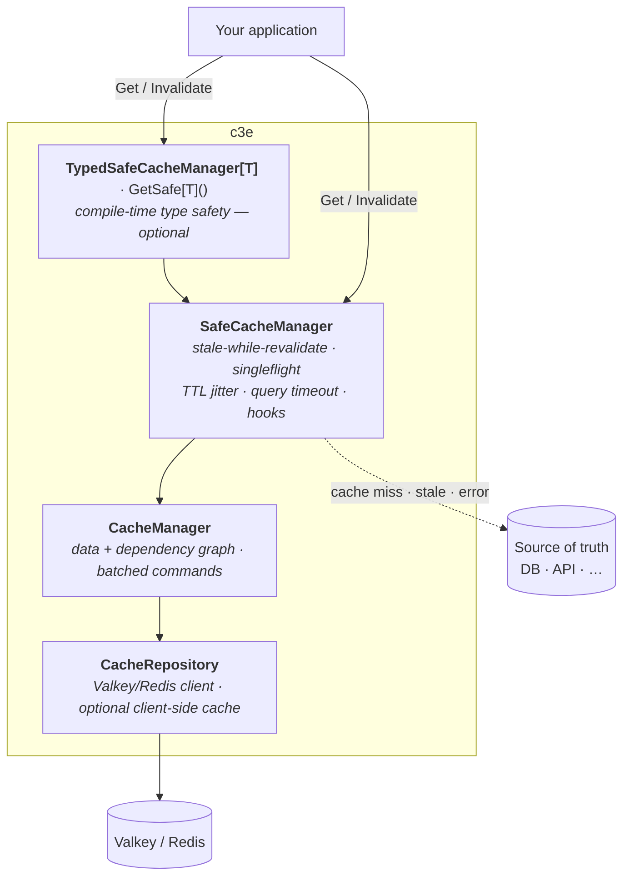
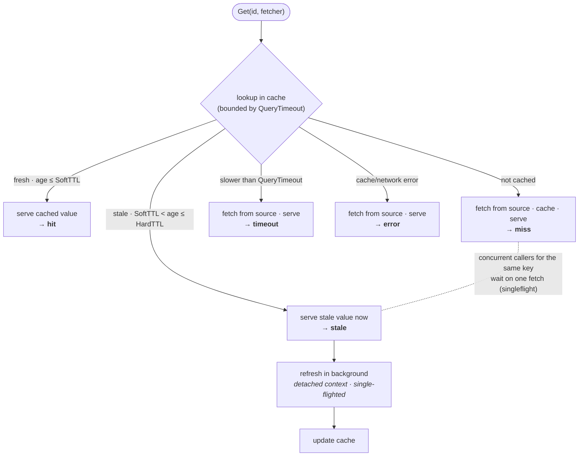
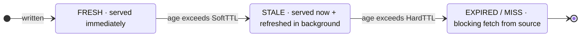
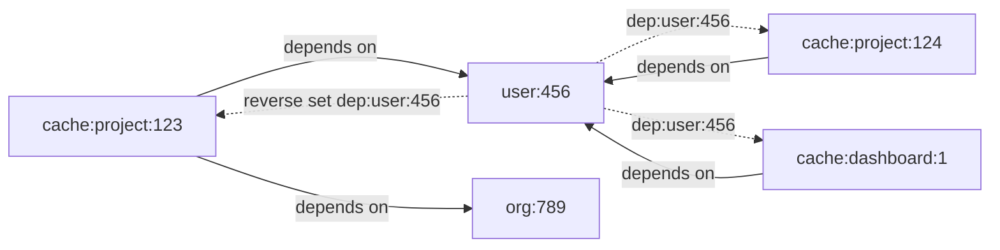
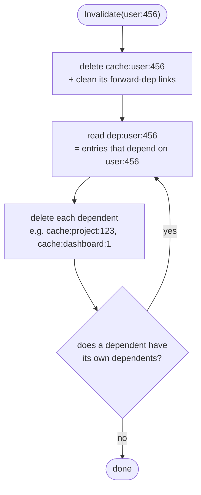

# Architecture

## Three-layer design

`c3e` layers from a low-level Valkey primitive up to an application-facing,
type-safe API. Each layer is optional to peel back.



- **`TypedSafeCacheManager[T]`** / **`GetSafe[T]()`** — a generic wrapper that
  adds compile-time type safety. Optional.
- **`SafeCacheManager`** — the application-facing API. Enforces
  stale-while-revalidate, singleflight thundering-herd protection, TTL jitter,
  a bounded query timeout, and observability hooks. **Use this in application
  code.**
- **`CacheManager`** — the low-level primitive. Direct Valkey operations plus
  dependency-graph maintenance.
- **`CacheRepository`** — the interface over the Valkey client; mock it in
  tests.

## Read path (stale-while-revalidate)

The outcome of every `Get` maps 1:1 to the `Result` reported to the `OnGet`
observability hook (`hit` · `stale` · `miss` · `timeout` · `error`):



- **Fresh** and **stale** both serve *immediately* — stale never blocks the
  caller; the refresh is detached (runs on a `context.WithoutCancel` copy of the
  request context, bounded by its own timeout) so it survives the request
  returning.
- **Miss / timeout / error** fall back to the source; concurrent callers for the
  same key are collapsed into a single fetch (thundering-herd protection).

## Cache states



## Key scheme & the dependency reverse index

Each cached item has a structured identifier:

```go
type CacheIdentifier struct {
    Type string // Entity type (e.g., "user", "project", "order")
    ID   string // Entity ID (e.g., "123", "user-456")
}
```

Three key families model the dependency graph so data, forward, and reverse
keys never collide:

| Key | Meaning |
| --- | --- |
| `cache:<type>:<id>` | the cached data (has a TTL) |
| `deps-for:cache:<type>:<id>` | **forward** list: what this entry depends on |
| `dep:<type>:<id>` | **reverse** set: which entries depend on this entity |

Caching `project:123` with dependencies on `user:456` and `org:789` builds a
reverse index — so changing an entity finds every entry that must be dropped:



When `user:456` is invalidated, its reverse set names every dependent, which are
deleted and cascaded — **downward only** (dependents), never up to dependencies:



> ⚠️ **You must invalidate a collection's key on inserts.** Dependency links
> only exist for items *already in* a cached list, so adding a new item to a
> cached collection is invisible to the graph — invalidate the collection's own
> key (or let it expire via TTL) when membership changes. See
> [Limitations](limitations.md).

## Performance characteristics

| Operation | Time complexity | Notes |
| --- | --- | --- |
| `Get` (hit) | O(1) | single Valkey `GET` |
| `Get` (miss) | O(1) + fetch + O(D) | D = dependency count |
| `Set` | O(D) | D = number of dependencies |
| `Invalidate` | O(N × D) | N = cascade depth, D = avg deps per level |

## Thread safety

All exported operations are safe for concurrent use:

- Concurrent reads of the same missing key are coalesced via singleflight, so
  only one fetcher runs.
- Dependency tracking uses Valkey server-side operations.
- No manual locking is required.

```go
// Safe to call concurrently from many goroutines — only ONE fetcher runs.
var wg sync.WaitGroup
for i := 0; i < 100; i++ {
    wg.Add(1)
    go func() {
        defer wg.Done()
        cache.Get(ctx, identifier, &result, fetcher)
    }()
}
wg.Wait()
```
